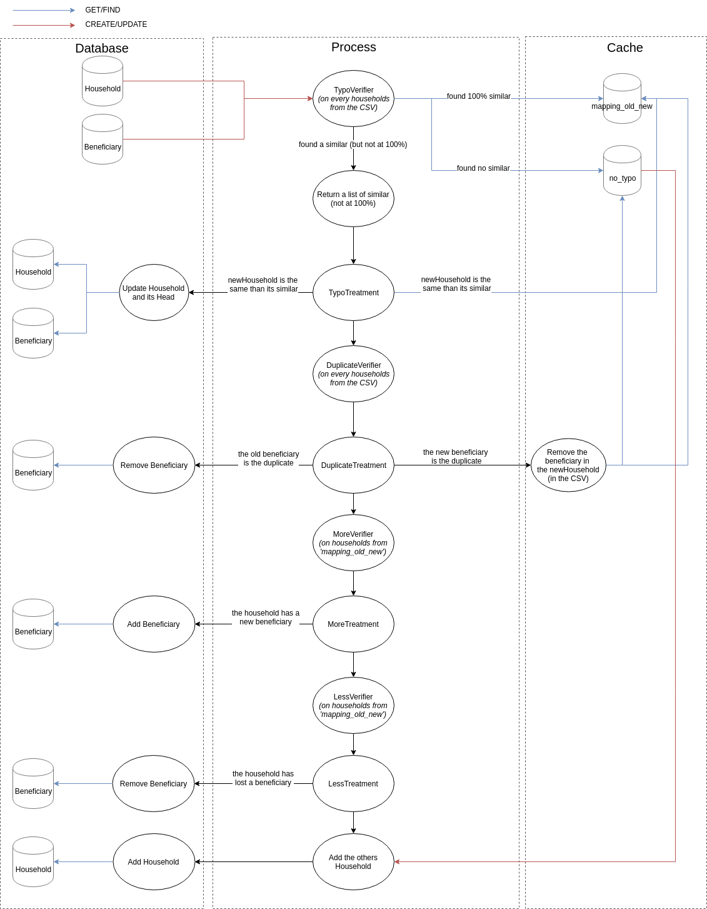

# BeneficiaryBundle

## INFOS

### Beneficiary

- **Status** :
```
    0: "Dependant",
    1: "Head of Household"
```
- **Livelihood** : 
```
    0: "Agriculture - Livestock",
    1: "Agriculture - Crops",
    2: "Agriculture – Fishing",
    3: "Agriculture – Other",
    4: "Mining",
    5: "Construction",
    6: "Manufacturing",
    7: "Retail",
    8: "Transportation",
    9: "Education",
    10: "Health Care",
    11: "Hospitality & Tourism",
    12: "Legal Services",
    13: "Home Duties",
    14: "Religious Service",
    15: "IT & Telecommunications",
    16: "Finance & Insurance",
    17: "Manual Labour",
    18: "NGO & Not for Profit",
    19: "Military or Police",
    20: "Government & Public Enterprise",
    21: "Garment Industry",
    22: "Security Industry",
    23: "Service Industry & Other Professionals",
    24: "Other"
```

### CSV 

In column with multiple information (like phones, you can have multiple phone numbers), with a ';' as separator.


## DATA VERIFICATION

### Concept




### Typo treatment

```json
{
  "new" : "either empty or household object",
  "id_old": 1,
  "state": "true or false"
}
```

- **state** = true & **new** = empty : ignore new, new is the same than the old
- **state** = true & **new** = Household object : ignore old, new is not the same than the old
- **state** = false & **new** = Household object : update old with data from the new (update only the Household and the beneficiary head of household)


### Duplicate treatment

```json
{
	"new_household": "either empty or household object",
	"data": [
		{
			"id_old": "id du beneficiary",
			"state": "true or false",
			"to_delete": {
				"given_name": "givenName",
				"family_name": "familyName"
			}
		}
	]
}
```

OR 

```json
{
	"new_household": "either empty or household object",
	"data": [
		{
			"id_old": "id du beneficiary",
			"state": "true or false",
			"new": "Household object"
		}
	]
}
```

- **to_delete** isset : delete the beneficiary in the new household
- **state** = true & **new** = Household object : keep the new and the old beneficiary
- **state** = false & **new** = Household object : keep the new beneficiary and remove the old beneficiary (if it's not a head of household)


### More treatment

```json
{
  "id_old": 1,
  "data": "ARRAY OF BENEFICIARIES OBJECT"
}
```

- Add every beneficiaries inside data array to the household (in database) with the id "id_old"


### Less treatment

```json
{
  "id_old": 1,
  "data": "ARRAY OF ID BENEFICIARY TO REMOVE"
}
```

- Remove every beneficiaries inside data array in the household (in database) with the id "id_old"

This step may return array with list of errors (or empty array if everything gone well).
The model of the return :
```json
{
  "household": "OBJECT HOUSEHOLD",
  "error": "a small text to explain the error"
}
``` 

## ROUTES


PUT ("/households/project/{id}")

```json
{
	"address_street": "addr",
	"address_number": "12",
	"address_postcode": "73460",
	"livelihood": 10,
	"notes": "this is just some notes",
	"latitude": "1.1544",
	"longitude": "120.12",
	"location": {
		"country_iso3": "FRA",
		"adm1": "Auvergne Rhone-Alpes",
		"adm2": "Savoie",
		"adm3": "Chambery",
		"adm4": "Ste Hélène sur Isère"
	},
	"country_specific_answers": [
		{
			"answer": "my answer",
			"country_specific": {
				"id": 1
			}
		}
	],
	"beneficiaries": [
		{
			"given_name": "name",
			"family_name": "family",
			"gender": 1,
			"status": 0,
			"residency_status": "resident",
			"date_of_birth": "1976-10-06",
			"updated_on": "2018-06-13 12:12:12",
			"profile": {
				"photo": "photo1"
			},
			"vulnerability_criteria": [
				{
					"id": 1
				}
			],
			"phones": [
				{
					"number": "0202514512",
					"type": "type1"
				}
			],
			"national_ids": [
				{
					"id_number": "1212",
					"id_type": "type1"
				}
			]
		},
		{
			"given_name": "name222",
			"family_name": "family2222",
			"gender": 0,
			"status": 0,
			"residency_status": "resident",
			"date_of_birth": "1976-10-06",
			"updated_on": "2018-06-13 12:12:12",
			"profile": {
				"photo": "photo2"
			},
			"vulnerability_criteria": [
				{
					"id": 1
				}
			],
			"phones": [
				{
					"number": "5545544584",
					"type": "type2"
				}
			],
			"national_ids": [
				{
					"id_number": "2323",
					"id_type": "type2"
				}
			]
		}
	]
}
```

POST ("/households/{id_household}/project/{id_project}")
```json
{
	"address_street": "add$*r2",
	"address_number": "12",
	"address_postcode": "73460",
	"livelihood": 10,
	"notes": "this is just some notes",
	"latitude": "1.1544",
	"longitude": "120.12",
	"location": {
		"country_iso3": "FRA",
		"adm1": "Auvergne Rhone-Alpes",
		"adm2": "Savoie",
		"adm3": "Chambery",
		"adm4": "Ste Hélène sur Isère"
	},
	"country_specific_answers": [
		{
			"answer": "my answer",
			"country_specific": {
				"id": 1
			}
		}
	],
	"beneficiaries": [
		{
			"id": 1,
			"given_name": "nameee2",
			"family_name": "family",
			"gender": 1,
			"status": 0,
			"residency_status": "resident",
			"date_of_birth": "1976-10-06",
			"updated_on": "2018-06-13 12:12:12",
			"profile": {
				"photo": "gkjghjk2"
			},
			"vulnerability_criteria": [
				{
					"id": 1
				}
			],
			"phones": [
				{
					"id": 1,
					"number": "020254512",
					"type": "type12"
				}
			],
			"national_ids": [
				{
					"id": 1,
					"id_number": "020254512",
					"id_type": "type12"
				}
			]
		}
	]
}
```


PUT ("/country_specifics")
```json
{
    "field": "field",
    "type": "type"
}
```