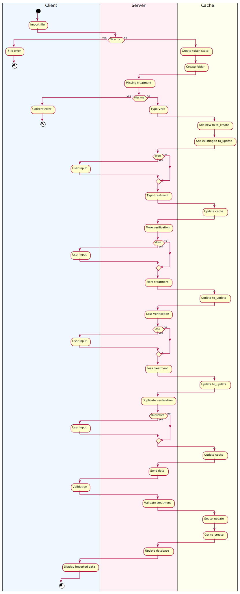

# BeneficiaryBundle

## INFOS

### Beneficiary

- **Status** :
```
    0: "Dependant",
    1: "Head of Household"
```
- **Livelihood** : 
```
    0: "Agriculture - Livestock",
    1: "Agriculture - Crops",
    2: "Agriculture – Fishing",
    3: "Agriculture – Other",
    4: "Mining",
    5: "Construction",
    6: "Manufacturing",
    7: "Retail",
    8: "Transportation",
    9: "Education",
    10: "Health Care",
    11: "Hospitality & Tourism",
    12: "Legal Services",
    13: "Home Duties",
    14: "Religious Service",
    15: "IT & Telecommunications",
    16: "Finance & Insurance",
    17: "Manual Labour",
    18: "NGO & Not for Profit",
    19: "Military or Police",
    20: "Government & Public Enterprise",
    21: "Garment Industry",
    22: "Security Industry",
    23: "Service Industry & Other Professionals",
    24: "Other"
```

### CSV 

In column with multiple information (like phones, you can have multiple phone numbers), with a ';' as separator.


## DATA VERIFICATION

### Concept

While there are no errors, the process will continue on the server-side.
\
A **step** variable is used to keep track of the current validation state.
When an error occurs, only the new and old beneficiaries causing this discrepancy are sent back to the client.
The user will compare and select which households and beneficiaries to save in the database.

The database will not be updated until the end of the process.
Temporary selected beneficiaries are stored in cache files before import.

At the beginning of the import process, a unique token is generated to keep track of the import's session.
A timestamp is generated at its start and refreshed at every step.
A duration of ten minutes per step is allowed to prevent cache overflow.

During this process, two files may be generated: *to_create* and *to_update*.

* *to_create*: contains new beneficiaries, when no error are encountered 
as well as well as on the **typo**, and **duplicates** treatments.

* *to_update*: contains updated beneficiaries, on the **typo**, **more** and **less** treatments.

At the end of the import process, these files are used to update the database.

### Flow Chart




### Typo treatment

This step will look for any typo made in the head of beneficiaries.

If an imported head's first name, last name or address matches any existing head with a one character difference 
it will be interpreted as a typo.
The user will have to choose whether to keep the **existing**, **imported** or **both** persons in the database.

#### Server response 

```json
{
  "data": [
      {
          "new": "Imported household containing the head with a typo",
          "old": "Existing household containing the head with a typo", 
          "id_tmp_cache": "Cache id corresponding to this household"
      }
  ],
  "step": 2,
  "token": "Current data validation token"
}
```

#### Client response
```json
{
    "errors": [
      {
        "new": "Imported household containing the head with a typo",
        "old": "Existing household containing the head with a typo", 
        "id_tmp_cache": "Cache id corresponding to this household",
        "state": "0 to only keep old, 1 to only keep new, 2 to keep both"
      }
    ]
}
```

### More treatment

This step will look for new beneficiaries in existing households.

If an imported household matching an entry in the database contains one or more new beneficiaries 
(birth, new member arriving in the household's home, ...), the user will be prompted to confirm the addition for this household.
He will **select** which beneficiaries to effectively import in the database.

#### Server response 


```json
{
  "data": [
      {
          "new": "Imported household",
          "old": "Existing household", 
          "id_tmp_cache": "Cache id corresponding to this household"
      }
  ],
  "step": 3,
  "token": "Current data validation token"
}
```

#### Client response
```json
{
    "errors": [
      {
        "new": "Imported updated household",
        "old": "Existing household", 
        "id_tmp_cache": "Cache id corresponding to this household"
      }
    ]
}
```

### Less treatment

#### Server response 

This step will look for any missing beneficiaries from the existing households.

If an imported household matching an entry in the database does not contains all the existing beneficiaries
(passing of a family member, departure of a member from the household's home, ...), the user will be prompted 
to confirm the addition for this household.
He will **select** which beneficiaries to effectively remove from the database.


```json
{
  "data": [
      {
          "new": "Imported household",
          "old": "Existing household", 
          "id_tmp_cache": "Cache id corresponding to this household"
      }
  ],
  "step": 4,
  "token": "Current data validation token"
}
```

#### Client response
```json
{
    "errors": [
      {
        "new": "Imported household",
        "old": "Existing updated household", 
        "id_tmp_cache": "Cache id corresponding to this household"
      }
    ]
}
```


### Duplicate treatment

This step will look for any existing beneficiary imported under a different household.

If an imported beneficiary's first name and last name match an database entry already part of another household,
he will be interpreted as a duplicate.
The user will have to choose whether to keep the **existing**, **imported** or **both** persons in the database.


#### Server response 


```json
{
  "data": [
      {
          "new": "Duplicated beneficiary found in the imported household",
          "new_household": "Imported household containing the duplicated beneficiary",
          "old": "Duplicated beneficiary found in the existing household",
          "old_household": "Existing household containing the duplicated beneficiary",  
          "id_tmp_cache": "Cache id corresponding to this household"
      }
  ],
  "step": 5,
  "token": "Current data validation token"
}
```

#### Client response
```json
{
    "errors": [
      {
        "new": "Duplicated beneficiary found in the imported household",
        "new_household": "Updated imported household containing the duplicated beneficiary",
        "old": "Duplicated beneficiary found in the existing household",
        "old_household": "Updated existing household containing the duplicated beneficiary",  
        "id_tmp_cache": "Cache id corresponding to this household"
      }
    ]
}
```

### Validate treatment

This step will prompt the user to validate the changes he made to the beneficiary before modifying the database.
The server's response does not contain any data, neither does the client's.

This is the last step the user can leave the import without impacting the database.
If he chooses to confirm, the to_update and to_create cache files will be applied to the database.
#### Server response 


```json
{
  "data": [],
  "step": 6,
  "token": "Current data validation token"
}
```

#### Client response
```json
{}
```

### Import summary

After a successful import the imported households will be sent back to the client to display a summary of the imported households.

The response does not contain any token nor step as the import is completed.
#### Server response 


```json
{
  "data": [
      {
        "address_number": "",
        "address_postcode": "",
        "...": "..."
      }
  ]
}
```
